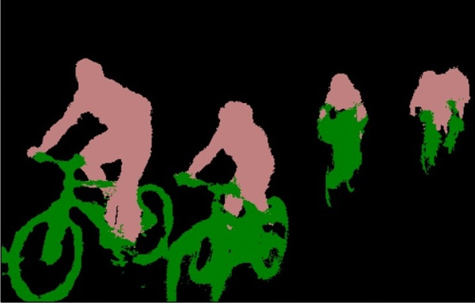
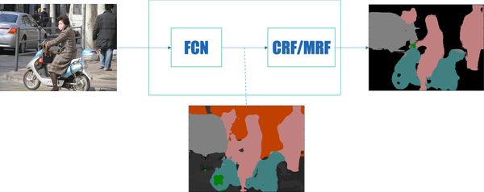
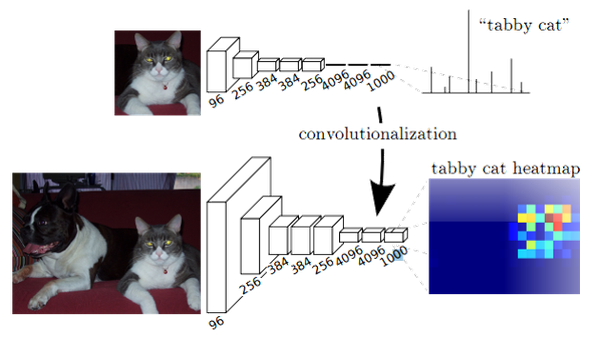
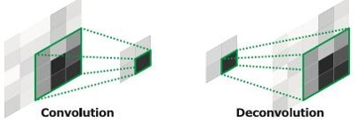
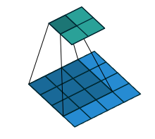
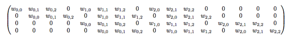
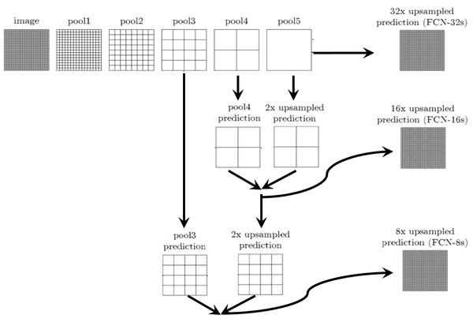
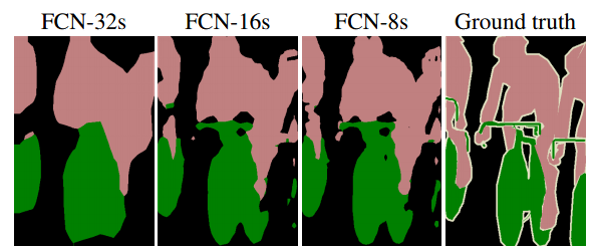
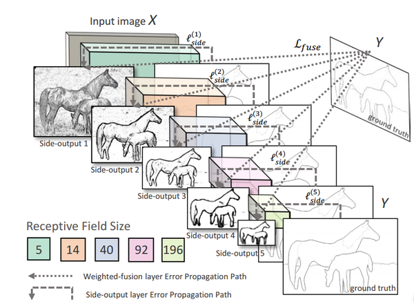
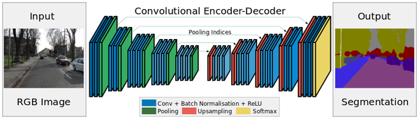

## 图像分割(Image Segmentation)

最初想法就是y是二值的，仅为0.1，然后把图像分成小块，eg 800*800的图像，分成10000个8*8的小块。用小块作为输入x，对x分类为0或者1（分割边缘）。但是8*8的小块往往不能贴合边缘

对于图像分割而言，要得到大量的完整标记过的图像非常困难，比如在ImageNet数据集上，有1400万张图有类别标记，有50万张图给出了bounding box,但是只有4460张图像有像素级别的分割结果

对训练图像中的每个像素做标记非常耗时，特别是对医学图像而言，完成对一个三维的CT或者MRI图像中各组织的标记过程需要数小时。


图像语义分割，简单而言就是给定一张图片，对图片上的每一个像素点分类从图像上来看，就是我们需要将实际的场景图分割成下面的分割图：
 

----

图像语义分割从深度学习引入这个任务（FCN）到现在而言，一个通用的框架已经大概确定了。即：
 

 -  FCN-全卷积网络
 - CRF-条件随机场
 - MRF-马尔科夫随机场
 

为什么需要FCN？
我们分类使用的网络通常会在最后连接几层全连接层，它会将原来二维的矩阵（图片）压扁成一维的，从而丢失了空间信息，最后训练输出一个标量，这就是我们的分类标签。
而图像语义分割的输出需要是个分割图，且不论尺寸大小，但是至少是二维的。所以，我们需要丢弃全连接层，换上全卷积层，而这就是全卷积网络了。


## FCN


全卷积网络首现于这篇文章(Fully Convolutional Networks for Semantic Segmentation)。这篇文章是将CNN结构应用到图像语义分割领域并取得突出结果的开山之作，因而拿到了CVPR 2015年的best paper.

作者的FCN主要使用了三种技术：
- 卷积化（Convolutional）
- 上采样（Upsample）
- 跳跃结构（Skip Layer）

####1 卷积化

分类所使用的网络通常会在最后连接全连接层，它会将原来二维的矩阵(图片)压缩成一维的，从而丢失了空间信息，最后训练输出一个标量，这就是我们的分类标签。而图像语义分割的输出需要是个分割图，且不论尺寸大小，但是至少是二维的。所以，我们丢弃全连接层，换上卷积层，而这就是卷积化了。
卷积化即是将普通的分类网络，比如VGG16，ResNet50/101等网络丢弃全连接层，换上对应的卷积层即可。
 
这幅图显示了卷积化的过程,图中显示的是AlexNet的结构，简单来说卷积化就是将其最后三层全连接层全部替换成卷积层


####2 上采样
此处的上采样即是反卷积（Deconvolution）。当然关于这个名字不同框架不同，Caffe和Kera里叫Deconvolution，而tensorflow里叫conv_transpose。CS231n这门课中说，叫conv_transpose更为合适。
众所诸知，普通的池化（为什么这儿是普通的池化请看后文）会缩小图片的尺寸，比如VGG16 五次池化后图片被缩小了32倍。为了得到和原图等大的分割图，我们需要上采样/反卷积。
反卷积和卷积类似，都是相乘相加的运算。只不过后者是多对一，前者是一对多。而反卷积的前向和后向传播，只用颠倒卷积的前后向传播即可。所以无论优化还是后向传播算法都是没有问题。图解如下：
 

为理解转置卷积，我们先来看一下Caffe中的卷积操作是怎么进行的,在caffe中计算卷积分为两个步骤：

1)使用im2col操作将图片转换为矩阵

2)调用GEMM计算实际的结果
这里举个简单的例子:
4x4的输入，卷积Kernel为3x3, 没有Padding / Stride, 则输出为2x2
 
输入矩阵可展开为16维向量，记作x
输出矩阵可展开为4维向量，记作y
卷积运算可表示为y = Cx
不难想象C其实就是如下的稀疏阵:
 
平时神经网络中的正向传播就是转换成了如上矩阵运算。

那么当反向传播时又会如何呢？首先我们已经有从更深层的网络中得到的
。根据矩阵微分公式可推得

Caffe中的卷积操作简单来说就是这样，那转置卷积呢？
其实转置卷积相对于卷积在神经网络结构的正向和反向传播中做相反的运算。
所以所谓的转置卷积其实就是正向时左乘C^T，而反向时左乘(C^T)^T，即C的运算。
虽然转置卷积层和卷积层一样，也是可以train参数的，但是实际实验过程中，作者发现，让转置卷积层可学习，并没有带来performance的提升，所以实验中的转置卷积层的lr全部被置零了

###### tensorflow 中的conv2d_transpose 调用
```python
sess = tf.Session()
batch_size = 3
output_shape = [batch_size, 8, 8, 128]
strides = [1, 2, 2, 1]

l = tf.constant(0.1, shape=[batch_size, 32, 32, 4])
w = tf.constant(0.1, shape=[7, 7, 128, 4])

h1 = tf.nn.conv2d_transpose(l, w, output_shape=output_shape, strides=strides, padding='SAME')
print sess.run(h1)
```
```
InvalidArgumentError: Conv2DCustomBackpropInput: Size of out_backprop doesn't match computed: actual = 32, computed = 4
```
Since tf.nn.conv2d_transpose is the backward (gradient) counterpart of tf.nn.conv2d, one way to see what the correct shapes should be is to use the corresponding forward operation:
```
output = tf.constant(0.1, shape=output_shape)
expected_l = tf.nn.conv2d(output, w, strides=strides, padding='SAME')
print expected_l.get_shape()
# Prints (3, 4, 4, 4)
```
solution:
```
l = tf.constant(0.1, shape=[batch_size, 4, 4, 4])

```
####3 跳跃结构
（也叫忽略连接结构）这个结构的作用就在于优化结果，因为如果将全卷积之后的结果直接上采样得到的结果是很粗糙的，所以作者将不同池化层的结果进行上采样之后来优化输出。具体结构如下：
 
而不同上采样结构得到的结果对比如下：
 
当然，你也可以将pool1， pool2的输出再上采样输出。不过，作者说了这样得到的结果提升并不大。
这是第一种结构，也是深度学习应用于图像语义分割的开山之作，所以得了CVPR2015的最佳论文。但是，还是有一些处理比较粗糙的地方，具体和后面对比就知道了。


#### loss 计算
```python

with tf.name_scope('loss'):
	    # [batch_size, width, height, num_classes]
        logits = tf.reshape(logits, (-1, num_classes))
        epsilon = tf.constant(value=1e-4)
        logits = logits + epsilon
        #[batch_size, width, height, num_classes]
        labels = tf.to_float(tf.reshape(labels, (-1, num_classes)))

        softmax = tf.nn.softmax(logits)

        if head is not None:
            cross_entropy = -tf.reduce_sum(tf.mul(labels * tf.log(softmax),
                                           head), reduction_indices=[1])
        else:
            cross_entropy = -tf.reduce_sum(
                labels * tf.log(softmax), reduction_indices=[1])

        cross_entropy_mean = tf.reduce_mean(cross_entropy,
                                            name='xentropy_mean')
        tf.add_to_collection('losses', cross_entropy_mean)

        loss = tf.add_n(tf.get_collection('losses'), name='total_loss')

```

### HED: FCN用于边缘检测

上一节讲到FCN适用于需要像素级预测的场景, 下面就介绍一个基于FCN的边缘检测的工作HED, 来自于屠卓文老师组, 发表在ICCV2015并且获得了Marr奖提名。
HED提出了side-output的概念, 在网络的中间的卷积层也对其输出上采样得到一个与原图一样的map, 并与ground-truth计算loss, 这些中间的卷积层输出的map称为side-output。 多个side-output产生的loss直接反向传导到对应的卷积层, 一定程度避免了梯度消失, 同时也在不同的卷积层(不同的感受野)学到了不同尺度的feature, 在edge-detection这个计算机视觉中古老的问题上取得了state-of-art的效果。
 
上图所示为HED的网络结构, 多个side-output产生的loss直接反向传到对应的卷积层。


### SegNet/DeconvNet
这样的结构总结在这儿，只是我觉得结构上比较优雅，它得到的结果不一定比上一种好。
######SegNet

 
######DeconvNet


反卷积如。而上池化的实现主要在于池化时记住输出值的位置，在上池化时再将这个值填回原来的位置，其他位置填0即OK。
 
 

######DeepLab
接下来介绍一个很成熟优雅的结构，以至于现在的很多改进是基于这个网络结构的进行的。
首先这里我们将指出一个第一个结构FCN的粗糙之处：为了保证之后输出的尺寸不至于太小，FCN的作者在第一层直接对原图加了100的padding，可想而知，这会引入噪声。
而怎样才能保证输出的尺寸不会太小而又不会产生加100 padding这样的做法呢？可能有人会说减少池化层不就行了，这样理论上是可以的，但是这样直接就改变了原先可用的结构了，而且最重要的一点是就不能用以前的结构参数进行fine-tune了。所以，Deeplab这里使用了一个非常优雅的做法：将pooling的stride改为1，再加上 1 padding。这样池化后的图片尺寸并未减小，并且依然保留了池化整合特征的特性。
但是，事情还没完。因为池化层变了，后面的卷积的感受野也对应的改变了，这样也不能进行fine-tune了。所以，Deeplab提出了一种新的卷积，带孔的卷积：Atrous Convolution.即：


#####1， ScribbleSup: Scribble-Supervised Convolutional Networks for Semantic Segmentation (CVPR 2016)

香港中文大学的Di Lin提出了一个基于Scribble标记的弱监督学习方法。 Scribble是一个很方便使用的标记方法，因此被用得比较广泛。如下图，只需要画五条线就能完成对一副图像的标记工作。


Graph cut 的能量函数为：
\sum_i\psi_i(y_i|X,S)+\sum_{i,j}\psi_{ij}(y_i,y_j,X)
在这个graph中，每个super-pixel是graph中的一个节点，相接壤的super-pixel之间有一条连接的边。这个能量函数中的一元项包括两种情况，一个是来自于scribble的，一个是来自CNN对该super-pixel预测的概率。整个最优化过程实际上是求graph cut能量函数和CNN参数联合最优值的过程：
\sum_i\psi_i^{scr}(y_i|X,S)+\sum_i-logP(y_i|X,\Theta)+\sum_{i,j}\psi_{ij}(y_i,y_j|X)
上式的最优化是通过交替求Y和\Theta的最优值来实现的。文章中发现通过三次迭代就能得到比较好的结果。
